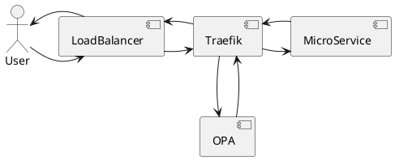

# traefik-opa-plugin 
Traefik plugin which connects to Open Policy Agent

# !!! IMPORTANT NOTE: this repo is now deprecated in favor of https://github.com/team-carepay/traefik-jwt-plugin !!!


This plugin can be used to validate requests before they reach the backend. The Open Policy Agent is a server which can be used to enforce any policy. Although OPA is a swiss army-knife, in this use-case we're going to use it to verify that a user has the required permissions to access the backend resource.



## Installation
The plugin needs to be configured in the Traefik static configuration before it can be used.
### Installation with Helm
The following snippet can be used as an example for the values.yaml file:
```values.yaml
pilot:
  enabled: true
  token: xxxxx-xxxx-xxxx

experimental:
  plugins:
    enabled: true

additionalArguments:
- --experimental.plugins.opa.moduleName=github.com/team-carepay/traefik-opa-plugin
- --experimental.plugins.opa.version=v0.0.3
```

### Installation via command line
```
traefik \
  --experimental.pilot.token=xxxx-xxxx-xxx \
  --experimental.plugins.opa.moduleName=github.com/team-carepay/traefik-opa-plugin \
  --experimental.plugins.opa.version=v0.0.3
```

## Configuration
The plugin currently supports the following configuration settings:
Name | Description
--- | ---
URL | The complete URL (including path) for the OPA data AP (e.g. `http://opa:8181/v1/data/example`)
AllowField | The field-name in the JSON result. This needs to be a boolean, indicating whether the request is allowed.

## Example configuration
This example uses Kubernetes Custom Resource Descriptors (CRD) :
```
apiVersion: traefik.containo.us/v1alpha1
kind: Middleware
metadata:
  name: opa
spec:
  plugin:
    opa:
      URL: http://opa:8181/v1/data/example
      AllowField: allow
---
apiVersion: networking.k8s.io/v1
kind: Ingress
metadata:
  name: test-server
  labels:
    app: test-server
  annotations:
    kubernetes.io/ingress.class: traefik
    traefik.ingress.kubernetes.io/router.middlewares: default-opa@kubernetescrd

```


For a complete example how to use the middleware in a project, see [example app](deployment/local/example-app/)

## JSON input payload
The plugin will translate the HTTP request (including headers and parameters) and forwards the payload as JSON to OPA. For example, the following URL: `http://localhost/api/path?param1=foo&param2=bar` will result in the following payload (headers are reduced for readability):

```
{
    "headers": {
      "Accept-Encoding": [
        "gzip, deflate, br"
      ],
      "X-Forwarded-Host": [
        "localhost"
      ],
      "X-Forwarded-Port": [
        "80"
      ],
      "X-Forwarded-Proto": [
        "http"
      ],
      "X-Forwarded-Server": [
        "traefik-84c77c5547-sm2cb"
      ],
      "X-Real-Ip": [
        "172.18.0.1"
      ]
    },
    "host": "localhost",
    "method": "GET",
    "parameters": {
      "param1": [
        "foo"
      ],
      "param2": [
        "bar"
      ]
    },
    "path": [
      "api",
      "path"
    ]
  }
```

## Example policy
The policies you enforce can be as complex or simple as you prefer. For example, the policy could decode the JWT token and verify the token is valid and has not expired, and that the user has the required claims in the token.

The policy below shows an simplified example:
```
package example

default allow = false

allow {
	input.method = "GET"
	input.path[0] = "public"
}

allow {
	input.method = "GET"
	input.path = [ "secure", i ]
  has_token([ "123", "456"])
}

has_token(tokens) {
    input.path[1] = tokens[i]
}
```
In the above example, requesting `/public/anything` or `/secure/123` is allowed, however requesting `/secure/xxx` would be rejected and results in a 403 Forbidden.


## License
This software is released under the Apache 2.0 License
